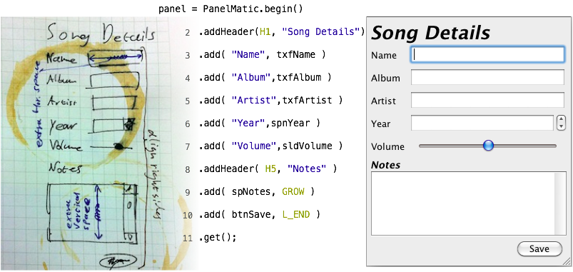

ifndef::env-github[:icons: font]
ifdef::env-github[]
:status:
:outfilesuffix: .adoc
:caution-caption: :fire:
:important-caption: :exclamation:
:note-caption: :page_with_curl:
:tip-caption: :bulb:
:warning-caption: :warning:
endif::[]

= PanelMatic

**An intuitive library for creating complex https://docs.oracle.com/javase/tutorial/uiswing/index.html[Java Swing] layouts.**

== Overview

VERY SHOT DESC.

Reference to blog post on mbarsinai.com

REFERENCE TO THE EXAMPLES DIR

IMAGES

== Using PaneMatic in a Project

=== From Maven Central

* Maven

* sbt

=== As a .jar File

== Change Log

=== 2020-12
* Initial https://maven.apache.org/[Maven]-based release, based on original release (which was based on https://ant.apache.org[Ant] and subversion, and was managed on Kenai.com).