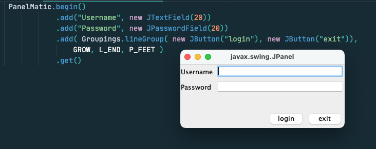
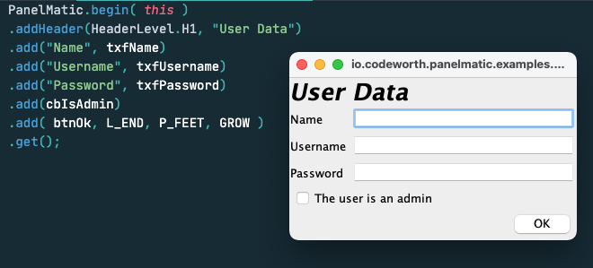
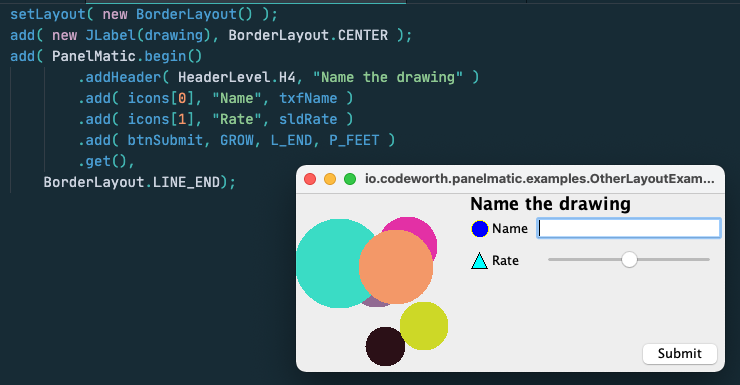
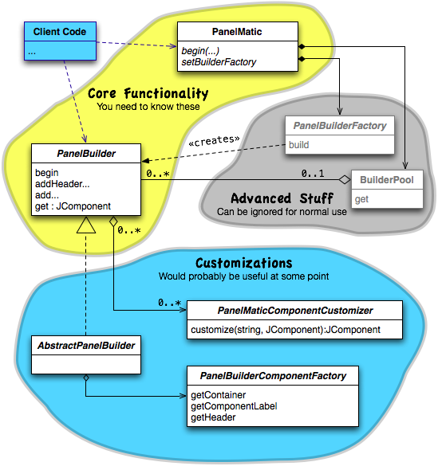

ifndef::env-github[:icons: font]
ifdef::env-github[]
:status:
:outfilesuffix: .adoc
:caution-caption: :fire:
:important-caption: :exclamation:
:note-caption: :page_with_curl:
:tip-caption: :bulb:
:warning-caption: :warning:
endif::[]

= PanelMatic

**An intuitive library for creating complex https://docs.oracle.com/javase/tutorial/uiswing/index.html[Java Swing] layouts.**

image::DOCS/sketch-code-gui.png[alt="layout to code to GUI process", align="center"]

== Overview

PanelMatic is a mature Swing helper library, created to allow easy creation of complex, high-quality layouts. A panels can be created using a single expression, whose structure directly relates to the way said panel looks.

PanelMatic It is highly customizable, supports right-to-left layouts, and provides an easy way of adding uniform listeners to panel components. The latter is useful, e.g., when one wants any change in a set of text fields to enable a "save" button.

image:https://maven-badges.herokuapp.com/maven-central/io.codeworth/PanelMatic/badge.png?style-plastic?style-plastic[link=https://repo.maven.apache.org/maven2/io/codeworth/PanelMatic/"]

image:https://img.shields.io/badge/javadocs-browse-green.svg[link="http://www.javadoc.io/doc/io.codeworth/PanelMatic/"]

[TIP]
====
A PanelMatic intro https://www.mbarsinai.com/blog/?p=146[is available at mbarsinai.com].

Many panel examples are available at the link:src/test/java/io/codeworth/panelmatic/examples[Examples directory] at the project's tests.
====

=== Sample Layouts (and the code that creates them)

.A simple login form
[link=DOCS/login-form.png]

.A slightly more complex user profile panel
[link=DOCS/simple-user-data.png]

.PanelMatic panel used with Swing's `BorderLayout`
[link=DOCS/with-another-layout.png]

.Nesting panels by nesting builders
[link=DOCS/combined-builders.png]
image::DOCS/combined-builders.png[align="center", 400]

=== Important Classes

The below diagram suggests which classes are more important for client code, and which could be safely ignored.

=== Single Expression Panels

The following examples show how PanelMatic's fluent API allows creation of a panel using a single expression.

[source, java]
----
System.out.println("A panel with two JLabels would "
				+ "have a preferred height of "
				+ PanelMatic.begin()
					.add( new JLabel("Label 1"))
					.add( new JLabel("Label 2"))
					.get()
					.getPreferredSize().height
			+ " pixels.");
----

output:

----
A panel with two JLabels would have a preferred height of 40 pixels.
----

== Using PanelMatic in a Project

=== From Maven Central

==== Maven 

Add the following to your `pom.xml`:

[source, xml]
----
<dependencies>
    <dependency>
        <groupId>io.codeworth</groupId>
        <artifactId>PanelMatic</artifactId>
        <version>0.9.8</version>
    </dependency>
    ...
</dependencies>
----

==== sbt

Add the following to your `build.sbt`:

[source, scala]
----
libraryDependencies += "io.codeworth" %% "PanelMatic" % "0.9.8"
----

=== As a .jar File

* Download from the link:releases[releases] page. PanelMatic does not have any external dependencies.

== Change Log

* JavaDocs updated.
* Initial https://maven.apache.org/[Maven]-based release, based on original release (which was based on https://ant.apache.org[Ant] and subversion, and was managed on Kenai.com).
* Updated in-repo documentation.